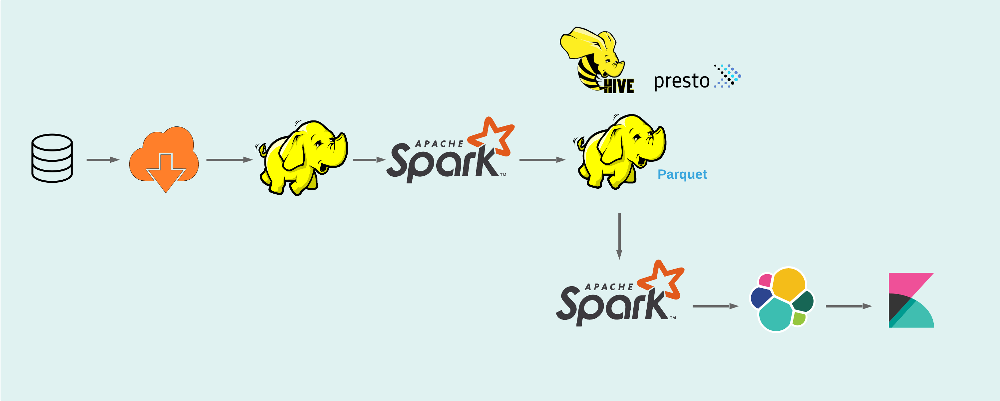
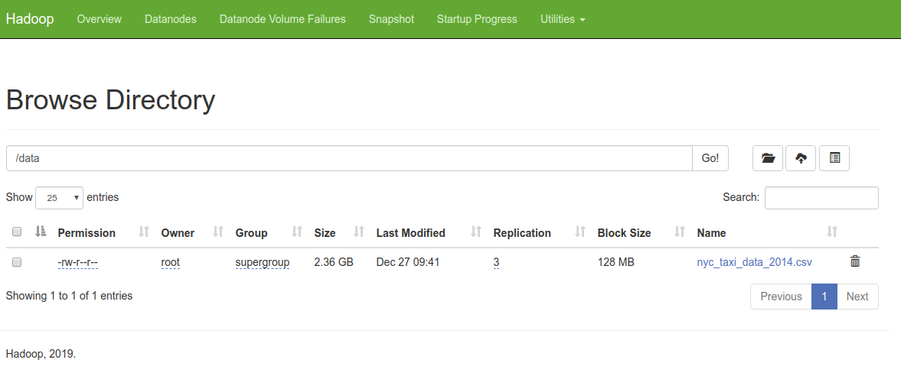
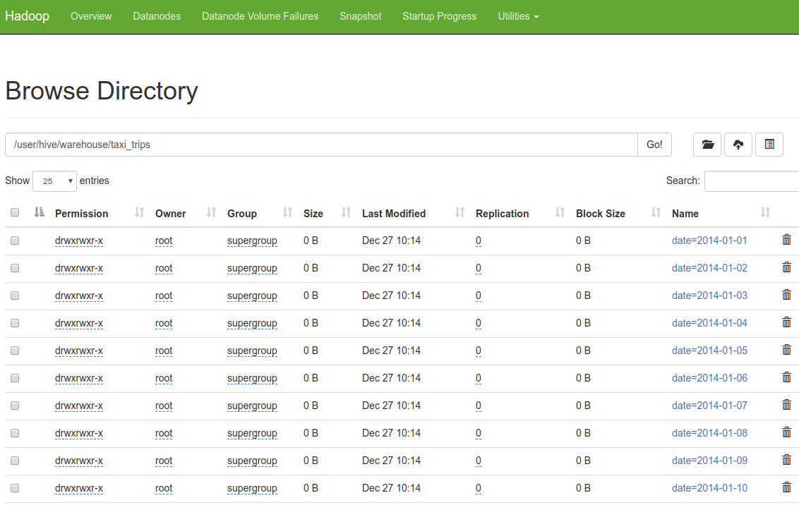
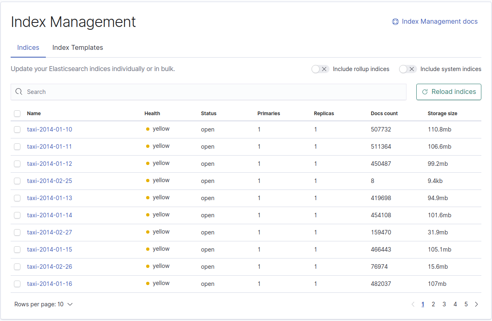
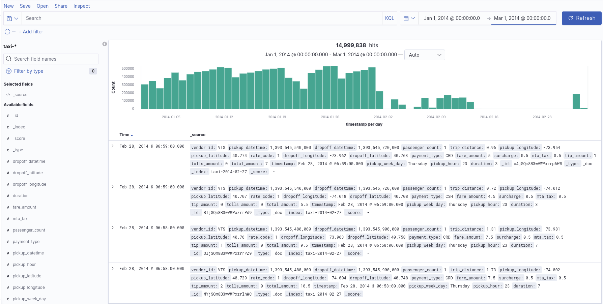
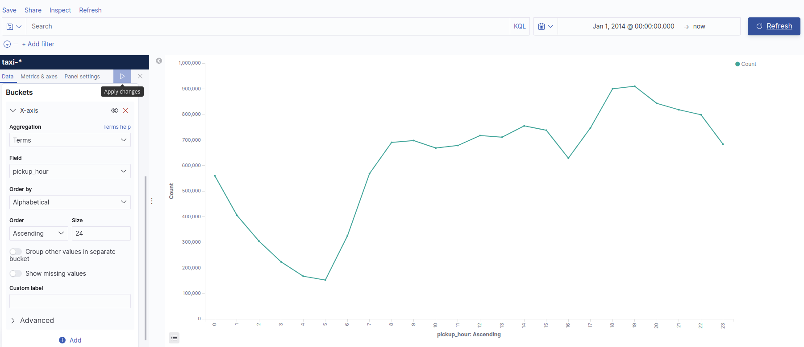
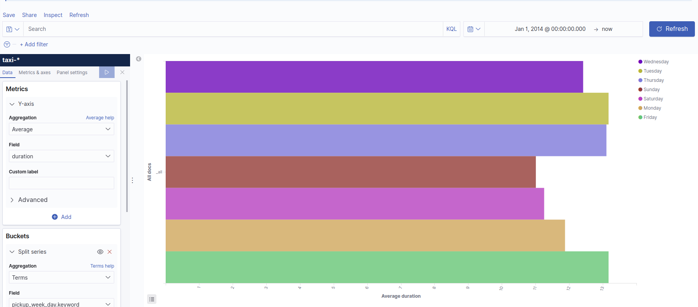

## Requirements

* Java 8 or higher
* Docker
* Docker compose



## Set up
Clone this repo:
```
$ git clone https://github.com/quannguyen22/teko.git
$ cd teko
$ make
```
The first step is to build the docker images and start the cluster based on those images.
To do that we'll execute the following command **from the root of this project**(*):
```
$ docker-compose up -d
```
After that we will create initial tables of hive metastore:
```
$ docker-compose exec hive-server bash
```
Run script for create initial tables of MySQL:
```
# /opt/hive/bin/schematool -dbType mysql -initSchema
```
Exit and restart again of **hive-metastore**
```
$ docker-compose up -d hive-metastore
```
Checking again of **docker-compose** to make sure all services are running:
```
$ docker ps -a
CONTAINER ID        IMAGE                  COMMAND                  CREATED             STATUS                    PORTS                                          NAMES
bf977160b691        teko/prestodb          "./bin/launcher run"     4 minutes ago       Up 4 minutes              8080/tcp                                       teko_presto-worker_1
82a0e55b5cd7        teko/prestodb          "./bin/launcher run"     5 minutes ago       Up 5 minutes              0.0.0.0:8080->8080/tcp                         teko_presto-coordinator_1
c961a266ecd0        kibana:7.5.1           "/usr/local/bin/dumb…"   26 minutes ago      Up 26 minutes             0.0.0.0:5601->5601/tcp                         teko_kibana_1
9646336d052c        teko/spark-processor   "entrypoint.sh bash"     26 minutes ago      Up 26 minutes                                                            teko_spark-processor_1
a6811b94a261        teko/datanode          "/entrypoint.sh /run…"   26 minutes ago      Up 26 minutes (healthy)   0.0.0.0:9864->9864/tcp                         teko_datanode_1
2e9ebabe8185        elasticsearch:7.5.1    "/usr/local/bin/dock…"   26 minutes ago      Up 26 minutes             0.0.0.0:9200->9200/tcp, 9300/tcp               teko_elasticsearch_1
f034e0850792        mysql:5.7.25           "docker-entrypoint.s…"   26 minutes ago      Up 26 minutes             0.0.0.0:3306->3306/tcp, 33060/tcp              teko_mysql_1
0737772f5b2b        teko/spark             "entrypoint.sh bin/s…"   26 minutes ago      Up About a minute                                                        teko_spark-worker_1
78d10d298e77        teko/namenode          "/entrypoint.sh /run…"   26 minutes ago      Up 26 minutes (healthy)   0.0.0.0:9870->9870/tcp                         teko_namenode_1
d6cb7d2fcd52        teko/hive              "entrypoint.sh /bin/…"   26 minutes ago      Up About a minute         0.0.0.0:10000->10000/tcp, 10002/tcp            teko_hive-server_1
faf05c99a512        teko/spark             "entrypoint.sh ./bin…"   26 minutes ago      Up About a minute         0.0.0.0:8089->8080/tcp                         teko_spark-master_1
84f85c3377e8        teko/spark-dumper      "entrypoint.sh bash"     26 minutes ago      Up 26 minutes                                                            teko_spark-dumper_1
20cff195765a        teko/hive              "entrypoint.sh /opt/…"   26 minutes ago      Up 15 seconds             10000/tcp, 0.0.0.0:9083->9083/tcp, 10002/tcp   teko_hive-metastore_1
3d9c99913b3f        teko/crawler           "entrypoint.sh bash"     26 minutes ago      Up 26 minutes                                                            teko_crawler_1
```

## Getting data to analyze
Dataset is availabe at kaggle but download big file is often interrupted, I move it to Google Drive:
```
$ docker-compose exec crawler download.sh https://drive.google.com/open?id=1QxDIblD-FVQ0bXwkyHu0N7yWr7w6mXjb
```
After that the original file is stored in hdfs



## Convert to parquet
The first step to use is to create the table with the data in parquet format(data is partitioned by date):
```
$ docker-compose exec spark-dumper submit.sh
```


### Querying in presto

```
$ ./presto.jar --server localhost:8080 --catalog hive --schema default
```
We should query something like: 
```
presto:default> select count(*) from taxi_trips;
  _col0   
----------
 14999999 
(1 row)

Query 20191227_031535_00011_sn3vr, FINISHED, 2 nodes
Splits: 66 total, 66 done (100.00%)
0:01 [15M rows, 0B] [12.1M rows/s, 0B/s]

presto:default> 
```

## Transform & write result to Elasticsearch

```
$ docker-compose exec spark-processor submit.sh
```
If your disk is nearly full, run command to ignore Elasticsearch's error
```
$ curl -XPUT -H "Content-Type: application/json" http://localhost:9200/_cluster/settings -d '{ "transient": { "cluster.routing.allocation.disk.threshold_enabled": false } }'
$ curl -XPUT -H "Content-Type: application/json" http://localhost:9200/_all/_settings -d '{"index.blocks.read_only_allow_delete": null}'
```
Now, we can use Kibana to visualize result(index parttern: taxi-*)



### Clean up
Stop the docker containers and remove volumes by doing:
```
$ docker-compose down
$ docker volume rm teko_datanode teko_namenode
```





